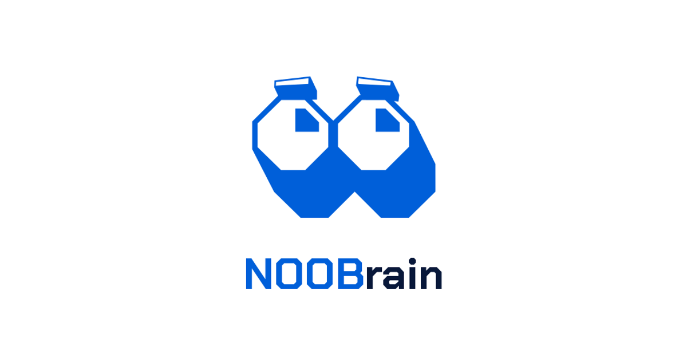

<p align="center">
  
</p>

<p align="center">
  <b>Aprende qualquer tema, um conceito de cada vez.</b><br>
  Escreves um tema, a IA monta uma trilha a partir de fontes abertas e tu aprendes, memorizas e testas, com revisão espaçada para não esquecer.
</p>

<p align="center">
  <a href="https://noobrain.vercel.app"><b>Experimentar →</b> noobrain.vercel.app</a>
</p>

<p align="center">
  
  
  
  
  
</p>

---

## O que faz

| | |
|---|---|
| 🧭 **Tema → trilha** | Escreves "Fernando Pessoa" ou "Sistema Solar" e recebes 6 a 8 conceitos por ordem, baseados na Wikipédia, Wikilivros, Wikiversidade e Wikisource. |
| 📖 **Lição guiada** | Cada conceito tem três passos: **Aprender** (explicação aos blocos), **Memorizar** (cartões) e **Testar** (quiz de 3 perguntas). |
| 💬 **Tutor** | Tiras dúvidas com um tutor de IA a qualquer momento da lição. |
| 🔁 **Revisão espaçada** | Os cartões voltam no momento certo (de 0 a 35 dias), com aviso no menu, na trilha e no título da aba. |
| ⚡ **XP e sequência** | Ganhas pontos e manténs a tua sequência de dias, como no Duolingo. |
| ☁️ **Conta** | O progresso fica guardado na nuvem (UE) e acompanha-te em qualquer aparelho. |

## Feito com

- **Next.js 16** (App Router) + TypeScript, CSS puro com tokens de design.
- **Supabase** (Paris) para contas e progresso, com segurança por linha (RLS).
- **Vercel** (funções em Paris).
- IA a partir de um único ficheiro (`lib/ai.ts`), por isso trocar de fornecedor é simples.

O NOOBrain é feito quase 100% com inteligência artificial: o código foi escrito por modelos de IA. As ideias, o design e as decisões são do Rodrigo, da [NOOBjects](https://github.com/NOOBjects).

## Correr no teu computador

```bash
npm install
cp .env.example .env.local   # preenche as chaves
npm run dev                  # http://localhost:3000
```

Antes de publicar: `npm run build` e `npm run lint`.

## Para quem contribui

- Regras, identidade visual e mapa do código: [`CLAUDE.md`](CLAUDE.md).
- Roteiro e trabalho em curso: [`PLANO.md`](PLANO.md).
- Ideias e problemas: abre uma *issue*.
